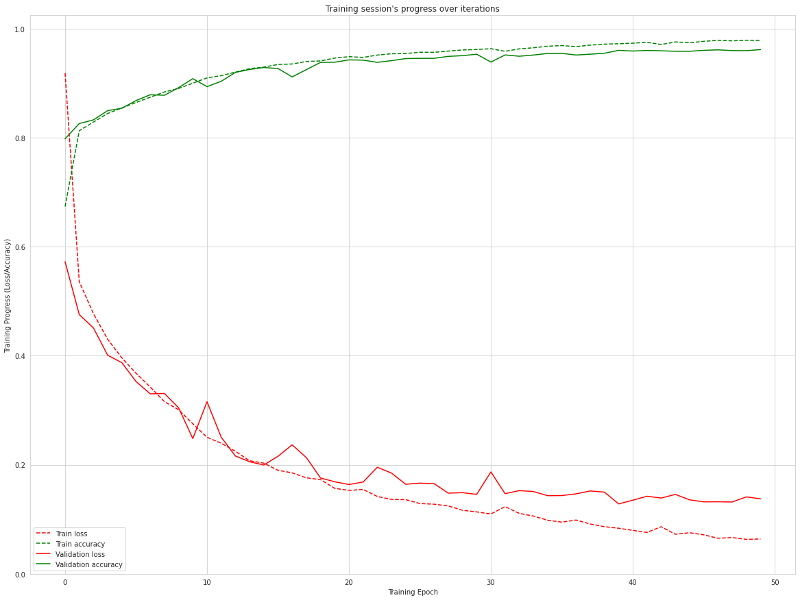

## LSTM Action Recognition using Smartphone Accelerometer data

### Introduction

##### Human Activity Recognition using Smartphone Accelerometer data, classify the actions to six different categories: walking, walking_upstairs, walking_downstairs, sitting, standing, laying. 
##### Long Short-Term Memory cells (LSTMs) require little or almost no feature engineering. Data can be fed directly into the neural network who acts like a black box, modeling the problem correctly. Other research on the activity recognition dataset can use a big amount of feature engineering, which is rather a signal processing approach combined with classical data science techniques. The approach here is rather very simple in terms of how much was the data preprocessed.

### Dataset 

##### Smartphones contain tri-axial accelerometers that measure acceleration in all three spatial dimensions.Dataset is from Department of Computer & Information Science, Fordham University, NY (<a href="https://www.cis.fordham.edu/wisdm/dataset.php">Link to the dataset</a>). Note that the file is the raw data file — WISDM_ar_v1.1_raw.txt

### LSTM Networks
##### Long Short Term Memory networks – usually just called “LSTMs” – are a special kind of RNN, capable of learning long-term dependencies. They were introduced by Hochreiter & Schmidhuber (1997), and were refined and popularized by many people in following work.1 They work tremendously well on a large variety of problems, and are now widely used.

### Results
##### Accuracy on Train set :- 97.86 %
##### Accuracy on Test set :- 96.16 %

